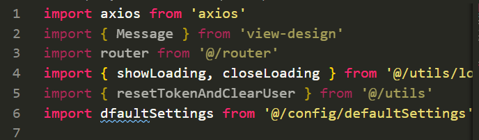
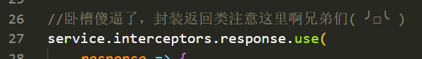
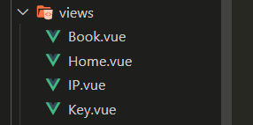
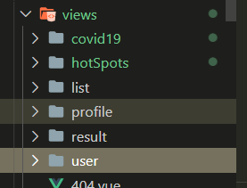
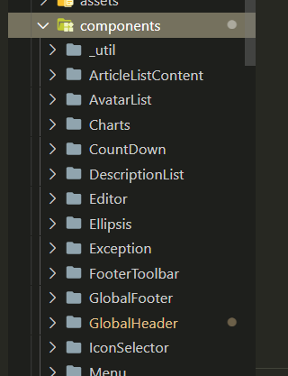

# 开发规范

1. vscode 安装 prettier 插件并开启自动格式化
   本代码库已经集成.prettierrc 配置文件，统一按照此配置文件格式化

2. 减少不必要的引用，防止代码混乱
   

3. 减少不必要的注释
   

4. 字符串统一单引号，缩进 2

5. vue 组件文件命名大驼峰 方法命名小驼峰

6. json 字符串，长的(超过三个)下划线分割，短的用小驼峰.如：`url_jump_params` `showTable`

7. 按照职责分类 views 层和通用封装组件 components 一样

   bad:

   

   good:

   
   
